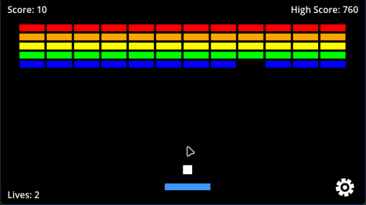

# 20 Games Challenge #2: Breakout (Godot 4)

Welcome to the second project of my **20 Games Challenge**! This is a fully functional, retro-inspired Breakout game built from the ground up using Godot 4. This project focuses on object instancing, grid management, and dynamic game balancing.

 ##
You can play the web version of the game directly on your browser via itch.io:
 **[Link to your itch.io page here]**

## Key Features

- **Procedural Brick Generation:** Bricks are generated via script using a grid system, allowing for flexible layouts.
- **Color-Coded Scoring:** Rows are visually distinct, with higher rows providing more points, encouraging strategic play.
- **Dynamic Speed Scaling:** The ball's speed increases with every brick destroyed, raising the stakes as the board clears.
- **Advanced Paddle Physics:** Controlled bounce angles based on the collision point (clamped for fair gameplay).
- **Retro Audio Experience:** Custom sound effects for wall bounces, brick destruction, and game-over states.
- **UI & Score System:** Real-time score tracking and an interactive game-over/win loop.

## Controls

- **Movement:** `A` / `D` or `Left` / `Right Arrow Keys` to move the paddle or simply using mouse.
- **Start/Restart:** `Space` or `R` to launch the ball or restart after a game over.
- **Menu:** `Esc` to pause.

## Technical Breakdown

- **Engine:** Godot 4.5 (GDScript)
- **Object Instancing:** Efficiently spawning bricks as scenes to handle large numbers of interactive objects.
- **Vector Math:** Implementing custom bounce logic to prevent "perfect vertical loops" and keep the gameplay engaging.
- **Signals & Groups:** Using Godot's group system for collision filtering and signals for UI updates.

## Assets & Credits

- **Visuals:** Custom sprites and UI elements inspired by [Kenney.nl](https://kenney.nl/).
- **Audio:** Retro SFX packs from [Kenney.nl](https://kenney.nl/).

---
